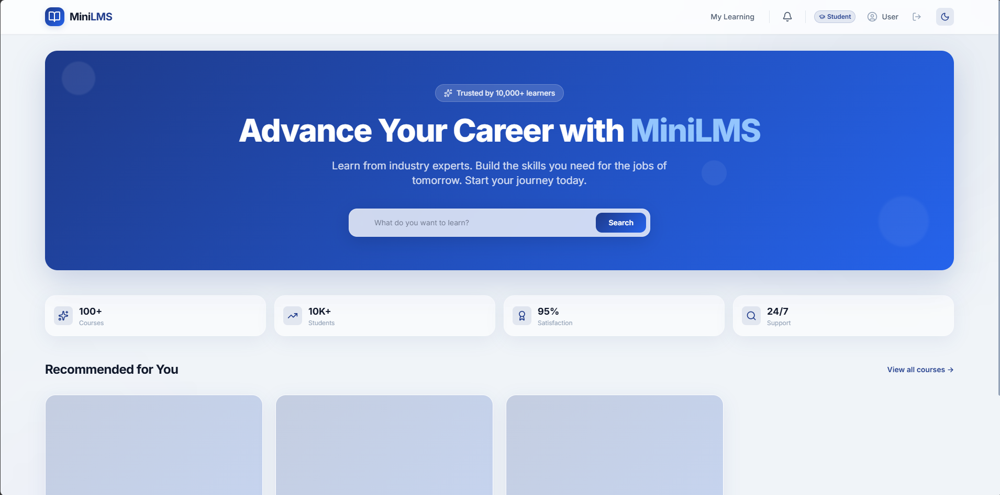
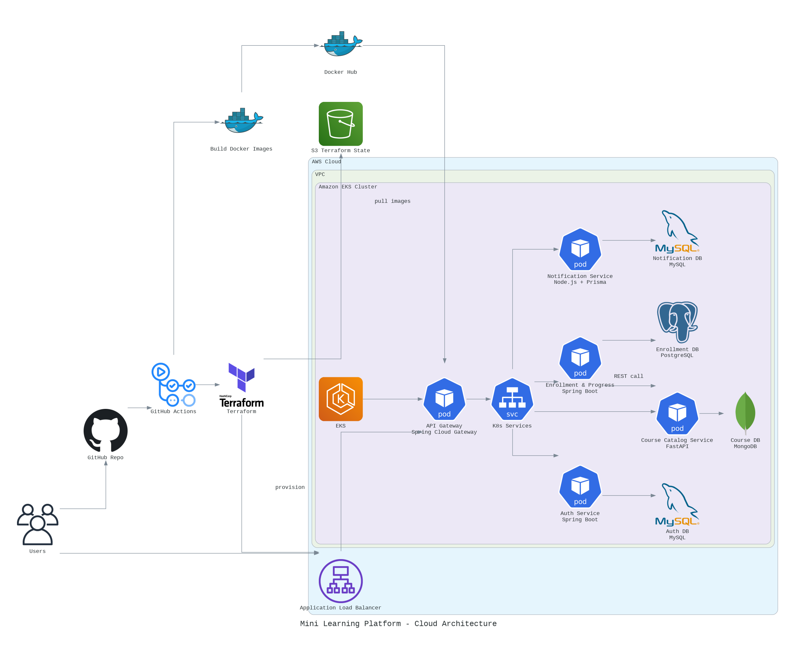

# Mini Learning Platform – Microservices

## 1. Project Title & Short Description
**Mini Learning Platform** is a comprehensive, scalable e-learning platform built using a microservices architecture. It enables users to browse courses, enroll, track progress, and receive notifications, demonstrating modern cloud-native development practices and polyglot microservice design.

## 2. Project Overview
This project implements a fully containerized polyglot microservices-based mini learning platform. It demonstrates modern cloud-native development practices, including service segregation, inter-service communication via REST, API Gateway routing, and the "Database per Service" pattern. Orchestration is seamlessly managed via Docker Compose.

## 3. Screenshots / Demo

### Website Preview


### System Architecture


## 4. Key Features
- **User Authentication & Authorization**: Secure login and registration flows.
- **Course Management**: Browse, search, and view detailed course information.
- **Enrollment & Progress Tracking**: Enroll in courses and track lesson completions.
- **Notifications**: Receive notifications for enrollments and course updates.
- **API Gateway**: A single entry point for all client requests, handling routing and cross-cutting concerns.
- **Polyglot Stack**: Services are written in Java, Python, and Node.js based on the best fit for the domain.
- **Independent Scaling**: Containerized architecture allows independent scaling and deployment of services.

## 5. Tech Stack
- **Frontend**: React 19, TypeScript, Vite, TailwindCSS, Axios
- **API Gateway**: Spring Cloud Gateway (Java)
- **User Auth Service**: Spring Boot, MySQL
- **Enrollment & Progress Service**: Spring Boot, PostgreSQL
- **Course Catalog Service**: FastAPI (Python), MongoDB
- **Notification Service**: Node.js, Express, MySQL
- **Infrastructure & Deployment**: Docker, Docker Compose, Nginx

## 6. System Architecture / Diagram

```text
Frontend (Port 5173)
   |
   v
API Gateway (Port 8080)
   |
   +--> User Auth Service (Port 8081, uses MySQL)
   |
   +--> Enrollment & Progress Service (Port 8082, uses PostgreSQL)
   |         |
   |         +--> Course Catalog Service (Port 8083, uses MongoDB)
   |
   +--> Notification Service (Port 8084, uses MySQL)
```

## 7. How It Works / Workflow
- Users interact with the React-based frontend.
- All requests are routed through the Spring Cloud API Gateway (`localhost:8080`).
- The Gateway dynamically routes requests to the appropriate backend microservice based on the URL paths.
- Each service manages its own state with a dedicated database to ensure loose coupling.
- When cross-service data is needed, services communicate via Synchronous REST (HTTP). For example, the Enrollment Service fetches course details directly from the Course Catalog Service.

## 8. Project Folder Structure
```text
mini-learning-platform-cloud-project/
│
├── api-gateway/                  # Spring Cloud Gateway
├── docker-init/                  # DB initialization scripts (SQL/Mongo)
├── front-end/                    # React + Vite application
├── services/                     # Backend Microservices
│   ├── Course Catalog Service/       # FastAPI + MongoDB
│   ├── Enrollment & Progress Service/# Spring Boot + PostgreSQL
│   ├── Notification Service/         # Node.js + MySQL
│   └── User-Auth-Service/            # Spring Boot + MySQL
│
├── docker-compose.yml            # Main orchestration file
└── README.md
```

## 9. Installation & Setup Guide

The easiest way to run the entire application, including all microservices and databases, is using **Docker Compose**.

### Prerequisites
* [Docker](https://docs.docker.com/get-docker/) installed and running.
* [Docker Compose](https://docs.docker.com/compose/install/) installed.

### Steps to Run
1. **Clone the repository** and navigate to the project root directory:
   ```bash
   cd mini-learning-platform-cloud-project
   ```

2. **Start the application**:
   Run the following command to build the images and start the containers in detached mode:
   ```bash
   docker-compose up --build -d
   ```
   *Note: The first time you run this command, it will take several minutes to download the base images and build all the microservices.*

3. **Verify the services are running**:
   ```bash
   docker-compose ps
   ```
   You should see containers for the databases (`mysql-db`, `enrollment-postgres`, `course-mongo`), the microservices (`auth-service`, `enrollment-service`, `course-catalog-service`, `notification-service`), the `api-gateway`, and the `front-end`.

### Accessing the Platform
* **Frontend UI**: [http://localhost:5173](http://localhost:5173)
* **API Gateway**: [http://localhost:8080](http://localhost:8080)

### How to Stop
To stop the application and remove the containers, run:
```bash
docker-compose down
```
If you also want to remove the database volumes (which will **delete all your data**), run:
```bash
docker-compose down -v
```

## 10. Environment Variables
The project uses `docker-compose.yml` to inject environment variables into the services. Key variables include:
- `MYSQL_ROOT_PASSWORD`
- `POSTGRES_DB`, `POSTGRES_USER`, `POSTGRES_PASSWORD`
- `MONGO_URI`, `DATABASE_NAME`, `COURSE_COLLECTION`
- Microservice connection URLs (e.g., `DATABASE_URL` for Notification Service).

## 11. API Endpoints (Examples)
All external requests should go through the API Gateway on `localhost:8080`.

- **User Auth Service**:
  - `POST /api/auth/register` - Register a new user
  - `POST /api/auth/login` - Authenticate a user
- **Course Catalog Service**:
  - `GET /api/courses` - Retrieve all courses
  - `GET /api/courses/{id}` - Retrieve a specific course
- **Enrollment Service**:
  - `POST /api/enrollments` - Enroll in a course
  - `GET /api/enrollments/user/{userId}` - Get enrollments for a user

## 12. Testing Instructions
- **API Testing**: You can test the APIs independently using Postman or cURL by targeting the API Gateway at `http://localhost:8080`.
- **Frontend Testing**: Access the UI at `http://localhost:5173` and use the built-in interface to trigger API calls seamlessly.

## 13. Docker / Deployment Instructions
- The entire application is containerized using `Dockerfile`s in each service directory.
- `docker-compose.yml` at the root level orchestrates the multi-container setup, including networking and volume management.
- For isolated service development, you can spin up just the databases:
  ```bash
  docker-compose up -d mysql-db enrollment-postgres course-mongo
  ```
  Then run your target service locally using its native tooling (e.g., `mvn spring-boot:run` or `uv run uvicorn`).

## 14. Key Engineering Decisions / Challenges
- **API Gateway as the Single Entry Point**: Ensures clients only communicate with one host, simplifying frontend configuration and enabling central routing/CORS handling.
- **Database per Service**: Adheres strictly to microservices best practices. No shared databases exist, ensuring loose coupling and isolated data domains.
- **Synchronous REST (HTTP) for Inter-Service Communication**: Chose HTTP REST for simplicity in communication (e.g., Enrollment Service directly requesting Course Summary from Course Catalog Service).

## 15. Contributors & Your Contribution
- Developed and maintained as a cloud computing academic project. 
*(Feel free to add your specific team member names and roles here)*

## 16. License / Acknowledgements
- **License**: MIT License (or relevant academic license)
- **Acknowledgements**: Developed for the EC7204 Cloud Computing module.
