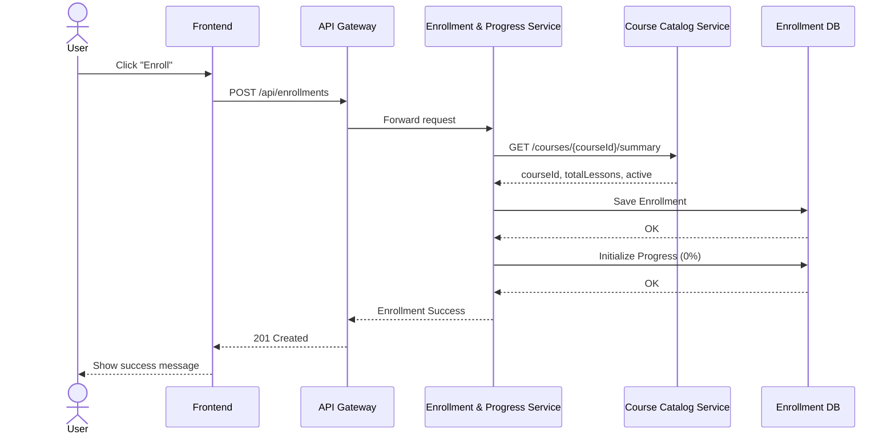
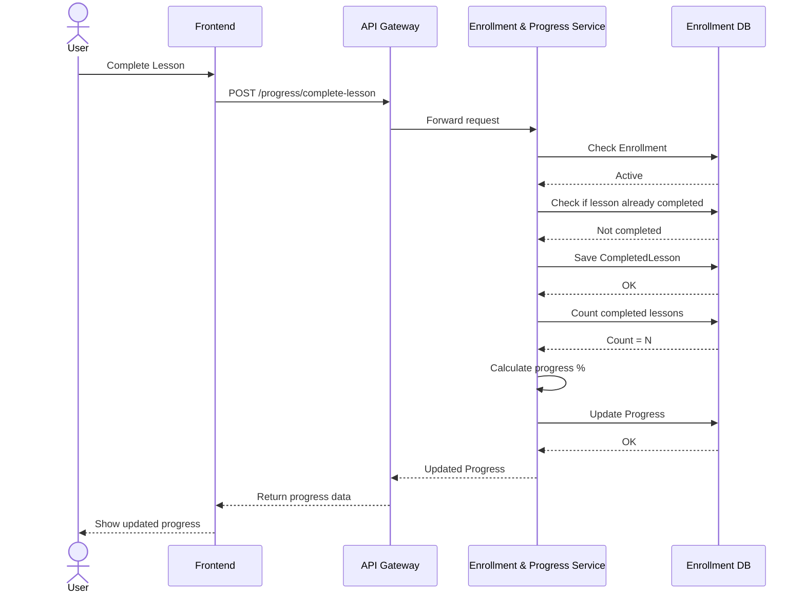

# Mini Learning Platform – Microservices

## Overview

This project implements a **microservices-based mini learning platform** using:

* **Spring Boot + PostgreSQL** → Enrollment & Progress Service
* **FastAPI + MongoDB** → Course Catalog Service

---

## Architecture

```text
Frontend
   |
   v
API Gateway
   |
   +--> Enrollment & Progress Service
             |
             +--> Course Catalog Service
```

---

# 🔁 Sequence Diagrams

---

## 1. Enroll in Course (Happy Path)



---

## 2. Complete Lesson & Update Progress



---

# 🔗 Inter-Service Communication

### Pattern

* **Synchronous REST (HTTP)**

### Example

Enrollment Service → Course Catalog Service:

```http
GET /api/courses/{courseId}/summary
```

Response:

```json
{
  "courseId": "68072d92f43c0d5c3f7c1111",
  "title": "Cloud Computing Basics",
  "totalLessons": 2,
  "active": true
}
```

---

# 🧠 Key Design Decisions

* API Gateway handles **client requests only**
* Services communicate **directly with each other**
* No shared database between services
* Each service owns its own data

---

# ⚙️ Services Setup

## Course Catalog Service

```bash
uv run uvicorn app.main:app --reload
```

Base URL:

```
http://localhost:8000
```

---

## Enrollment & Progress Service

```bash
mvn spring-boot:run
```

Base URL:

```
http://localhost:5003
```

---

# 🚀 Future Improvements

* API Gateway (Spring Cloud Gateway)
* JWT Authentication Service
* RabbitMQ / Kafka (async communication)
* Docker + Kubernetes deployment

---

